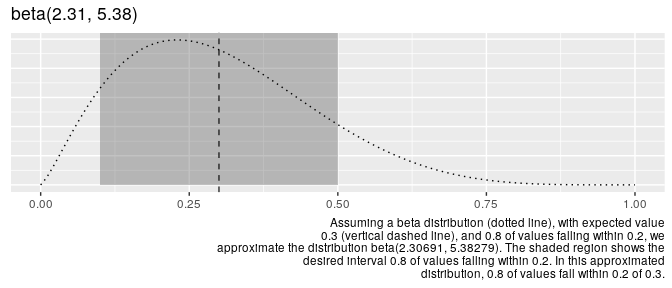
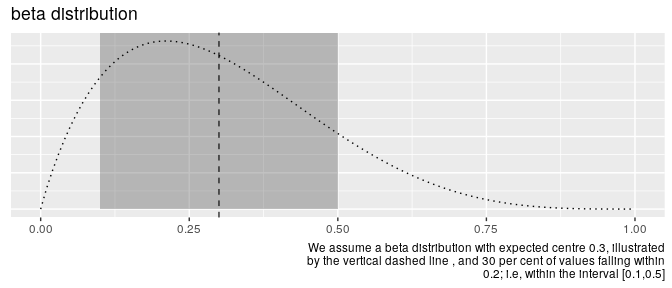

<!-- README.md is generated from README.Rmd. Please edit that file -->

# parameterpal

<!-- badges: start -->

<!-- badges: end -->

Rather than knowing intrinsically what parameters are required for a
distribution, scientists tend to have a sense of what value they
*expect* a measure to take, *how many* observations should fall *within*
a certain distance of that value.

For the normal distribution, this is straightforward, as the parameters
reflect the expected value and variance. However, for the beta
distribution, the parameters are not so readily interpretable.

`parameterpal::` provides a means of obtaining the parameters required
for the beta distribution from interpretable conditions.

## Installation

``` r
devtools::install_github("softloud/parameterpal", build_vignettes = TRUE)
```

## intended user

This package was developed for a friend and collaborator, computational
ecologist [Dr Matthew Grainger](https://github.com/DrMattG), who
previously used browser-based tools to obtain beta parameters to inform
his rstats workflow. I hope he finds this package a useful augment to
his codeflow.

# using `parameterpal::`

Load the package.

``` r
library(parameterpal)
```

Suppose we expect a value of 0.3, with 80 per cent of observations
falling within a distance of 0.2 from 0.3. That is, we expect 90 per
cent of observations to fall within (0.1, 0.5). Assuming data follow a
beta distribution, what are its parameters?

``` r

beta_pal(expected_value = 0.3,
          within = 0.2,
          this_much = 0.8)
#> $shape1_est
#> [1] 2.306909
#> 
#> $shape2_est
#> [1] 5.382787
```

We can plot this intuition to see the shape of the resulting beta
distribution.

``` r
beta_plot(expected_value = 0.3,
          within = 0.2,
          this_much = 0.8)
```



Escaping the ubiquitous tyranny of the arbitary bounds 90 or 95 per
cent, which don’t necessarily reflect our intuition, `this_much` is left
for the user to define. Suppose we thought only 30 per cent of values
fall within the interval.

``` r
beta_plot(expected_value = 0.3,
          within = 0.2,
          this_much = 0.3)
```



# vignette

See `vignette("betapal")` for more information. Fully disclosure, I need
to update it after I fully understand this
[gist](https://gist.github.com/daob/1422e978ff98bdf466fbcb4d9bf3e53e) I
was provided with after posting to twitter. Talk about a lesson in open
science. Blogpost incoming on open science and why it’s good to share
bad math and beta research code.

# other distributions

No reason the same math can’t be applied to other distributions. Open an
issue if you’d like me to provide parameters from interpretable
conditions for another distribution.
