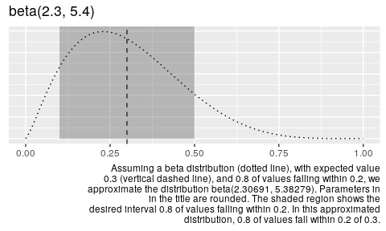
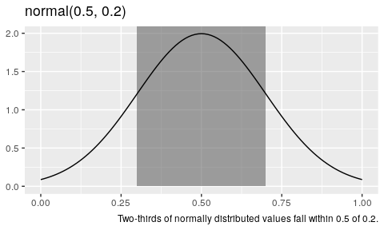
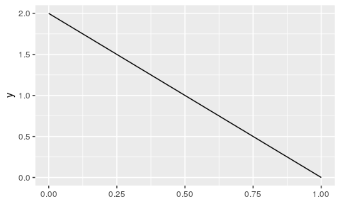

<!-- README.md is generated from README.Rmd. Please edit that file -->

# parameterpal

<!-- badges: start -->

<!-- badges: end -->

Rather than knowing intrinsically what parameters are required for a
distribution, scientists tend to have a sense of what value they
*expect* a measure to take, *how many* observations should fall *within*
a certain distance of that value.

For the normal distribution, this is straightforward, as the parameters
reflect the expected value and variance. However, for the beta
distribution, the parameters are not so readily interpretable.

`parameterpal::` provides a means of obtaining the parameters required
for the beta distribution from interpretable conditions.

## Installation

``` r
devtools::install_github("softloud/parameterpal", build_vignettes = TRUE)
```

## intended user

This package was developed for a friend and collaborator, computational
ecologist [Dr Matthew Grainger](https://github.com/DrMattG), who
previously used browser-based tools to obtain beta parameters to inform
his rstats workflow. I hope he finds this package a useful augment to
his codeflow.

# citing this package

``` r
citation(package = "parameterpal")
#> Warning in citation(package = "parameterpal"): could not determine year for
#> 'parameterpal' from package DESCRIPTION file
#> 
#> To cite package 'parameterpal' in publications use:
#> 
#>   Charles Gray, Hien Nguyen, Matthew Grainger, Matthew Henderson and
#>   Daniel Oberski (NA). parameterpal: Intepretable parameters for the
#>   beta distribution. R package version 0.0.1.
#> 
#> A BibTeX entry for LaTeX users is
#> 
#>   @Manual{,
#>     title = {parameterpal: Intepretable parameters for the beta distribution},
#>     author = {Charles Gray and Hien Nguyen and Matthew Grainger and Matthew Henderson and Daniel Oberski},
#>     note = {R package version 0.0.1},
#>   }
```

# vignette

Do you use beta distributions in your science? Do you find the
parameters uninterpretable?

Obtain parameters for the beta distribution from interpretable
conditions.

## installation

``` r
devtools::install_github("softloud/parameterpal", build_vignettes = TRUE)
```

## using `parameterpal::`

``` r
library(parameterpal)
```

``` r
usage_example <- list(
  expected_value = 0.3,
  within = 0.2,
  this_much = 0.8
) 
```

Suppose we expect a value of 0.3, with 80 per cent of observations
falling within a distance of 0.2 from 0.3.

That is, we expect 80 per cent of observations to fall within (0.1,
0.5). Assuming data follow a beta distribution, what are its parameters?

``` r
beta_pal(expected_value = usage_example$expected_value,
         within = usage_example$within,
         this_much = usage_example$this_much)
#> $shape1_est
#> [1] 2.306909
#> 
#> $shape2_est
#> [1] 5.382787
```

We can plot this intuition to see the shape of the resulting beta
distribution.

``` r
beta_plot(expected_value = usage_example$expected_value,
         within = usage_example$within,
         this_much = usage_example$this_much)
```



Specifying the width enables us to escape the ubiquitous tyranny of the
arbitary bounds of 95 per cent, which doesn’t necessarily reflect our
intuition, suppose we thought only

``` r
new_example_width <- 0.3
  
```

30 per cent of values fall within the interval.

``` r
beta_pal(expected_value = usage_example$expected_value,
         within = usage_example$within,
         this_much = new_example_width)
#> $shape1_est
#> [1] 0.3087453
#> 
#> $shape2_est
#> [1] 0.7204056
```

## motivation

Rather than knowing intrinsically what parameters are required for a
distribution, scientists tend to have indirect knowledge. A researcher
may have a sense of what value they *expect* a measure to take, *how
many* observations should fall *within* a certain distance of that
value. As well as the overall shape of the data, the distribution.
Distributions are not defined in the intuitive terms the scientist has,
but equational parameters commonly (but not always) \(\mu\) and
\(\sigma\) for the normal distribution, \(\lambda\) for the exponential,
and \(\alpha\) and \(\beta\) for the beta distribution. However,
calculating the required parameters is not necessarily straightfoward,
despite the conditioning we receive from the normal distribution.

``` r
# set normal distribution example parameters
norm_expected_value <- 0.5
norm_within <- 0.2
```

For the normal distribution, obtaining the parameters from these
assumptions is straightforward. The expected value and variance, which
is to say, centre and spread, of the normal distribution, are both
easily interpretable and translate directly to the parameters required
for the distribution. So, to sample three values from a normal
distribution where we expect a value of 0.5 with two-thirds of values
falling within 0.2 of 0.5, we simply run the following code.

``` r
rnorm(n = 3, 
      mean = norm_expected_value,
      sd = norm_within)
#> [1] 0.3772879 0.4092443 0.3863862
```

The first parameter is the expected value, and the second, the variance.
For the normal distribution, the standard deviation is interpretable. We
know two-thirds of values fall within one standard deviation of the
mean. If we shade this area in a visualisation, it’s convincing that
two-thirds of values fall within this range.



The beta distribution, on the other hand, requires two shape parameters,
`shape1` and `shape2`, which do not immediately reflect our intuition of
what value we expect the measure to take, nor how much variance we
expect.

But if we wished to sample from beta distribution, however, the
parameters, `shape1` and `shape2`, are not readily interpretable from
expected value and variance. `parameterpal::` provides a means of
obtaining the parameters required for the beta distribution from
interpretable conditions.

## beta distribution

The beta distribution has some really nice properties. It is bounded by
a minimum value of 0 and a maximum of 1, so is perfect for modeling
proportions.

Under some circumstances it can mimic a truncated bell curve, as well as
flexibility for other shapes, such as a truncated parabola.

But this is not intuitive. What shape do we expect
\(\mathrm{beta}(1,2)\) to take? It’s hard to intuit from the parameters
1 and 2. But, we likely do not expect a negatively sloped line.

``` r
ggplot() +
  xlim(0, 1) +
stat_function(
  fun = dbeta,
  args = list(shape1 = 1, shape2 = 2)
)
```



## original application

This code was developed for
[`softloud/simeta::`](https://github.com/softloud/simeta), research
software that supported `softloud`’s dissertation. This problem is a
very small component of a larger collection of simulation functions for
randomly generating meta-analysis data.

In this case, given a population \(N\), what proportion are allocated to
the case and control groups? A desire to reflect the uncertainty of
designed experiments motivated this code.

For example, even if case and control groups were assigned evenly, in
experimental science there are many reasons individuals may drop out of
the groups. Thus a proportion of \(N\) was sampled from a beta
distribution (which is bounded between 0 and 1, as proportions are,
too), with an intuition of how many drop outs are anticipated.

## launch vignette in rstudio

See `vignette("betapal")` for ~~more information~~ the same information,
but from the handy ease of your Rstudio Viewer pane.

Full disclosure, I need to update it after I fully understand this
[gist](https://gist.github.com/daob/1422e978ff98bdf466fbcb4d9bf3e53e) I
was provided with after posting to twitter. Talk about a lesson in open
science. Blogpost incoming on open science and why it’s good to share
bad math and beta research code. So cool I’ve ended up with a better,
more mathematically correct solution after posting it.

# other distributions

No reason the same math can’t be applied to other distributions. Open an
issue if you’d like me to provide parameters from interpretable
conditions for another distribution.

# report bugs, suggest improvements

Please do open an issue if you notice something, even if it’s just a
typo. I’m noticing things I missed all over the shop.
